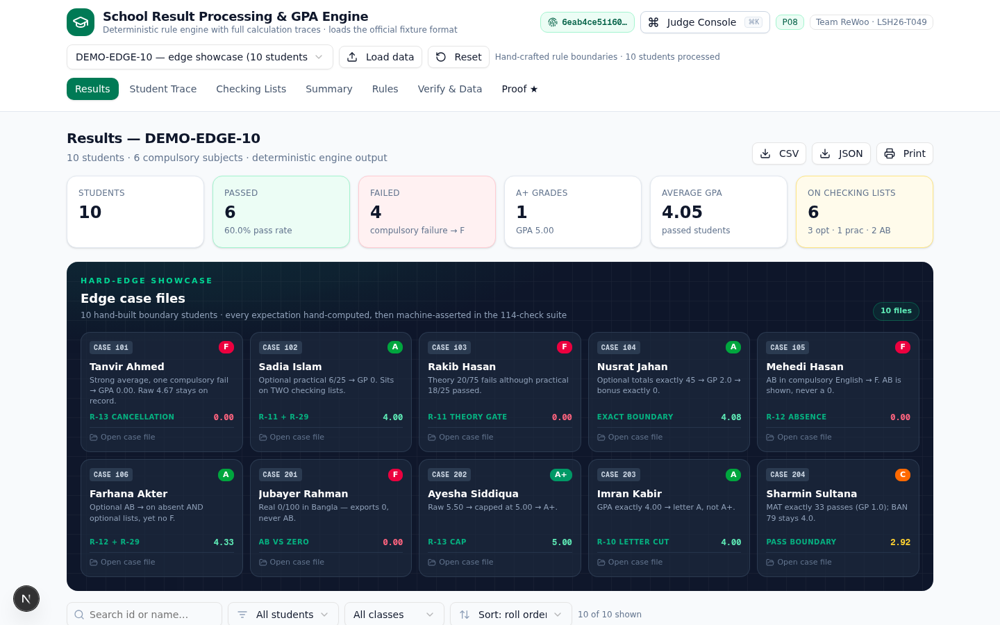
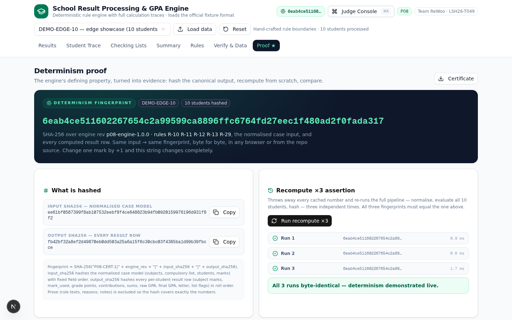
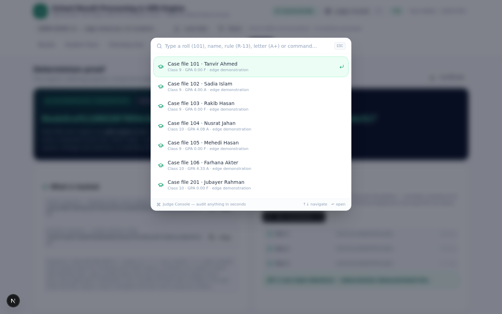
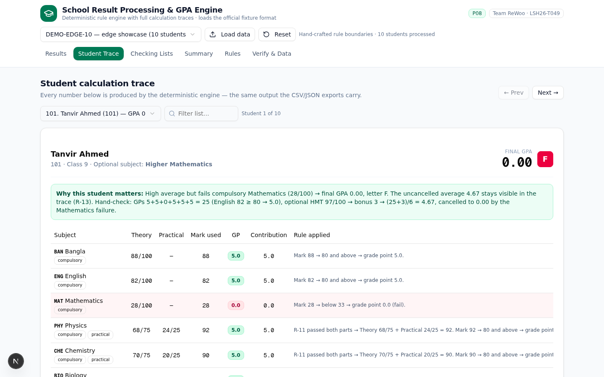
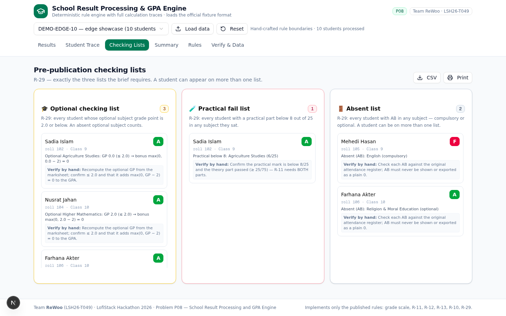
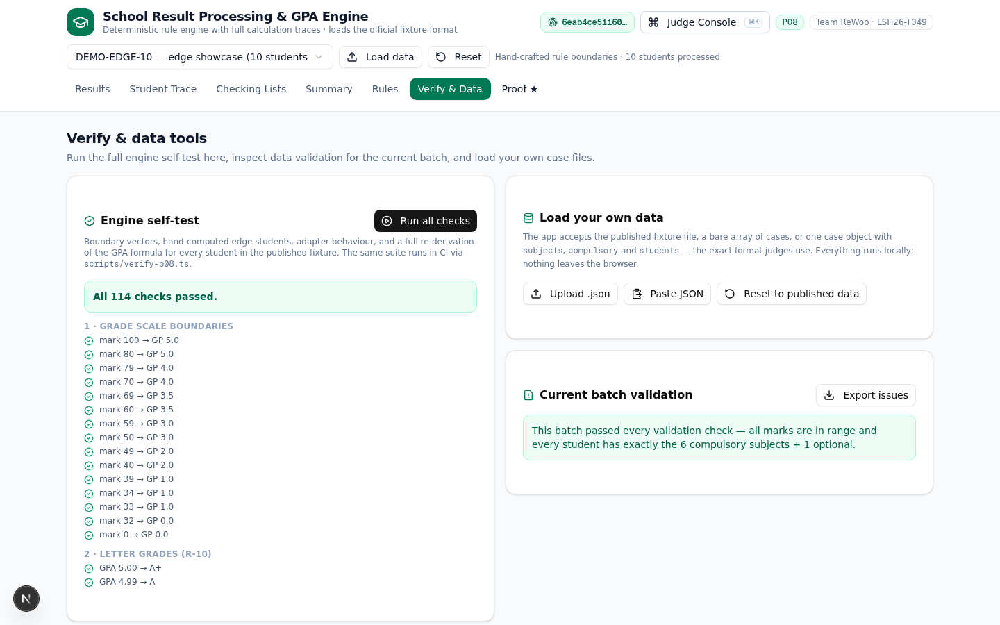

# School Result Processing & GPA Engine

Solution for **LofiStack Hackathon 2026 — P08**

## Project information

- **Team:** `ReWoo`
- **Team ID:** `LSH26-T049`
- **Problem:** `P08 — School Result Processing and GPA Engine`
- **Repository:** [`lsh26-t049-p08`](https://github.com/AdilShamim8/lsh26-t049-p08)
- **Live application:** <https://preview-chat-6f6d073c-f828-4241-b7af-b2e4c5e67f28.space-z.ai/>
- **Demo video:** Not supplied (optional)

> Judges will evaluate only the exact commit SHA entered in the Final Submission Form.

## Screenshots

| | |
| --- | --- |
|  |  |
|  |  |
|  |  |

## Solution summary

A deterministic, client-side grading engine that turns the official P08 case format
(`case_id` / `subjects` / `compulsory` / `students`) into per-student marksheets, final
GPAs, letters and the three R-29 checking lists — with a full calculation trace for every
number it prints. It ships the entire published fixture (25 cases, 1,765 students) bundled
offline, loads judge-shaped JSON by upload or paste, and verifies itself in the browser
with a 114-check suite.

Two features exist because the problem's defining property is **determinism** — so we made
determinism *checkable* instead of claimed:

- **Determinism Proof tab (SHA-256 fingerprint).** Every computed batch is serialised into
  a canonical byte form and hashed. The Proof tab shows the fingerprint, re-runs the whole
  pipeline three times from scratch ("Recompute ×3 — all runs byte-identical"), exposes a
  one-line command that reproduces the identical hash from this repository
  (`bun scripts/fingerprint.ts PUB-02`), and downloads a determinism certificate JSON.
  The SHA-256 implementation is self-contained and asserted against the official NIST test
  vectors in the self-test suite. Change any single mark by +1 and the fingerprint changes
  completely — a tamper seal over the whole engine.
- **Judge Console (⌘K).** A command palette that audits anything in seconds: type a roll
  (101), a name, a rule id (R-13), a letter (A+) or a command (run self-test, open proof,
  export CSV, switch batch) and jump straight there — keyboard-first, no clicking through
  tabs.

## Requirements

| Requirement | Status | Where to verify |
| --- | --- | --- |
| R1 — Load the published fixture and judge-shaped cases (file, paste, bundled) | Complete | Header data bar + `src/lib/p08/fixture.ts` (`parseFixtureInput`, `normalizeCase`) + Verify & Data tab |
| R2 — Subject grading with R-11 part rules (theory ≥ 25/75, practical ≥ 8/25, either fail → GP 0) | Complete | `src/lib/p08/engine.ts` (`evaluateSubject`) + any Student Trace row |
| R3 — Absence rules R-12 (AB ≠ 0; compulsory AB → F; optional AB → 0 + lists) | Complete | `src/lib/p08/engine.ts` + Student Trace of `DEMO-EDGE-10` rolls 105 (compulsory AB) and 106 (optional AB, on BOTH lists) |
| R4 — GPA formula R-13: (Σ compulsory GP + max(0, opt GP − 2)) / 6, cap 5.00, 2 dp, failure cancels but uncancelled average stays visible | Complete | `src/lib/p08/engine.ts` (`computeStudentResult`) + “GPA walkthrough (R-13)” panel |
| R5 — Letter grades R-10 from the final GPA (A+ 5.00 … D 1.00–1.99, F) | Complete | `src/lib/p08/engine.ts` (`letterForGpa`) + Results table |
| R6 — R-29 checking lists (optional GP ≤ 2.0, practical part < 8, any AB) with multi-list membership | Complete | “Checking Lists” tab + per-student list badges + CSV/print export |
| R7 — Full per-student calculation trace with rule citations | Complete | “Student Trace” tab (rule text embeds the student’s real numbers) |
| R8 — Self-verification and input validation | Complete | “Verify & Data” tab (114 checks incl. NIST SHA-256 vectors) + `scripts/verify-p08.ts` + per-batch validation panel + Proof tab |

## How to test the application

1. Open the live application. The batch selector defaults to **PUB-02 — published fixture
   (60 students)**; the results table, stats and checking lists are already computed.
2. Click any row (or open **Student Trace**) — the trace shows theory/practical splits,
   the mark used, the grade point, the rule applied with the student’s real numbers, and
   the step-by-step R-13 GPA walkthrough (including the uncancelled average for failed
   students).
3. Open **Checking Lists** — the three R-29 lists with exact reasons and a **“Verify by
   hand”** instruction on every row; students appear on every list they qualify for, and
   the whole page downloads as CSV or prints for the office.
4. Open **DEMO-EDGE-10** from the batch selector — 10 hand-crafted boundary students in
   rolls **101–106 (Class 9)** and **201–204 (Class 10)**. The Results tab shows the
   **Edge case files** wall where every card deep-links straight into that student’s full
   calculation trace.
5. Open **Verify & Data** and press **Run all checks** — 114 assertions run in the browser.
6. Open **Proof** and press **Run recompute ×3** — watch the pipeline recompute from scratch
   three times and produce byte-identical SHA-256 fingerprints; then copy the
   `bun scripts/fingerprint.ts PUB-02` command and get the same hash from the repo source.

## Grading rules implemented (verbatim)

**Mark → grade point (R-10)**

| Mark | GP | | Final GPA | Letter |
| --- | --- | --- | --- | --- |
| 80–100 | 5.0 | | 5.00 | A+ |
| 70–79 | 4.0 | | 4.00–4.99 | A |
| 60–69 | 3.5 | | 3.50–3.99 | A- |
| 50–59 | 3.0 | | 3.00–3.49 | B |
| 40–49 | 2.0 | | 2.00–2.99 | C |
| 33–39 | 1.0 | | 1.00–1.99 | D |
| 0–32 | 0.0 (fail) | | Fail | F |

**Split subjects (R-11):** theory out of 75 (pass ≥ 25), practical out of 25 (pass ≥ 8);
both parts must pass, GP comes from the combined mark, failing either part → subject GP 0.
**Absence (R-12):** AB is never a number — compulsory AB → overall F; optional AB →
contributes 0 and flags the checking lists. **GPA (R-13):** `(Σ 6 compulsory GP +
max(0, optional GP − 2)) / 6`, capped at 5.00, shown to 2 decimals; a compulsory failure
cancels the result (0.00 / F) but the uncancelled average stays visible.
**Checking lists (R-29):** optional GP ≤ 2.0 · practical part < 8 · any AB — a student can
sit on several lists at once.

## Ten verified edge-case students (batch DEMO-EDGE-10)

Every expected output below is hand-derived **and** asserted by the 114-check suite.
Open the batch, search the roll, and compare against this table.

| Roll | Student | Edge covered | Expected output |
| --- | --- | --- | --- |
| 101 | Tanvir Ahmed | Strong average, one compulsory fail (MAT 28) | Uncancelled (25 + 3)/6 = **4.67** visible; final **0.00 / F**; Mathematics named as the cause |
| 102 | Sadia Islam | Optional practical fail (AGR practical 6/25), theory passes | Optional GP **0**; on **both** practical-fail and optional lists; GPA **4.00 / A** |
| 103 | Rakib Hasan | Theory fail (PHY 20/75), practical passes (18/25) | Physics GP 0 → **0.00 / F**, uncancelled **3.67**; NOT on practical-fail list (18 ≥ 8) |
| 104 | Nusrat Jahan | Optional total exactly 45 (30+15) | Optional GP exactly **2.0** → bonus max(0, 2−2) = 0; on optional list; GPA **4.08 / A** |
| 105 | Mehedi Hasan | AB in compulsory English | Cell shows **AB**, not 0; **0.00 / F**; uncancelled **4.17**; on absent list |
| 106 | Farhana Akter | AB in optional Religion | Appears on **BOTH** absent and optional lists; overall **NOT** F; GPA **4.33 / A** |
| 201 | Jubayer Rahman | Real zero (BAN 0/100) vs AB | Cell shows **0**, NOT on absent list; **0.00 / F**, uncancelled **2.58** |
| 202 | Ayesha Siddiqua | GPA cap | Raw (30 + 3)/6 = **5.50** → capped **5.00 / A+** |
| 203 | Imran Kabir | Letter boundary | Raw exactly **4.00** → letter **A**, not A+ |
| 204 | Sharmin Sultana | Mark boundaries | MAT exactly **33** → GP 1.0 pass; BAN **79** → GP 4.0 (not 5.0); GPA **2.92 / C** |

## How to verify our results by hand

Pick any student and audit the engine with a calculator in about a minute:

1. **Per subject** — for subjects without a practical, take the mark straight to the
   R-10 table above. For split subjects, check the two gates first (theory ≥ 25/75,
   practical ≥ 8/25); if either fails the subject GP is 0, otherwise add the parts
   (e.g. theory 68 + practical 24 = 92 → GP 5.0) and use the R-10 table.
2. **Sum the six compulsory GPs** — the trace labels each row `compulsory` and prints
   the GP to one decimal (e.g. 5.0 + 5.0 + 0.0 + 5.0 + 5.0 + 5.0 = 25.0).
3. **Apply the optional bonus** — bonus = max(0, optional GP − 2). An optional GP of 5.0
   adds 3.0; an optional GP of 2.0 or less adds nothing and flags the optional list.
4. **Divide by 6 and cap** — raw = (Σ + bonus) / 6; the final GPA is min(raw, 5.00),
   printed to exactly two decimals. If any compulsory subject failed, the final result is
   **0.00 / F** and the trace keeps the uncancelled figure visible — that is the number
   your hand calculation produced.
5. **Cross-check the lists** — optional GP ≤ 2.0 → optional list; any practical part < 8
   (in a subject the student sat) → practical-fail list; any AB → absent list. Students
   legitimately appear on several lists at once (see roll 106 Farhana Akter).
6. **Prefer raw data?** the Results tab **CSV/JSON** exports carry every intermediate
   value (per-subject marks, mark used, GP, contribution, Σ, raw and final GPA, list
   flags) for the whole batch, and the **Verify & Data** tab re-runs the entire 114-check
   suite in your browser.

## Proving determinism, not claiming it

| Step | What you do | What you get |
| --- | --- | --- |
| 1 | Open the **Proof** tab | The batch’s fingerprint — e.g. PUB-02 → `d2dd6c7a6cbc8e4a…` |
| 2 | Press **Run recompute ×3** | Three from-scratch recomputes; all hashes byte-identical, with timings |
| 3 | Copy `bun scripts/fingerprint.ts PUB-02` | The **same** fingerprint, recomputed from the repository source — the deployed app and the shipped code are the same machine |
| 4 | Press **Certificate** | A JSON certificate (input hash, output hash, fingerprint, engine rev, recompute proof, repro command) |

What is hashed: `fingerprint = SHA-256("P08-CERT-1" + engine rev + case id + input_sha256 + output_sha256)`.
The input hash covers the normalised case model (subjects, compulsory list, every mark);
the output hash covers every per-student result row (marks used, grade points,
contributions, sums, raw and final GPA, letter, list flags) in roll order. Prose is
excluded so the hash covers exactly the numbers. The hash function itself is verified
against the NIST SHA-256 test vectors (`""`, `"abc"`, quick-brown-fox) in category 9 of
the self-test suite.

### Test or sample data

- **Published fixture:** bundled at `src/lib/p08/fixture-data.json` (release v2.2, 25
  cases) — the app works fully offline; no upload needed.
- **Judges’ own cases:** “Load data → Upload .json” or “Paste JSON” accepts the whole
  fixture file (`{"cases": [...]}`), a bare array of cases, or one case object with
  `subjects` / `compulsory` / `students` — the same shape as the published pack.
- **Reset:** the header **Reset** button (or “Reset to published data”) restores the
  bundled fixture and discards all imported batches. State is in-memory only; a page
  reload is equally a full reset.
- **Exports:** CSV and JSON downloads on the Results tab carry every intermediate value
  (per-subject marks, GP, contributions, raw and final GPA, list flags) for spot-checking.

## Run locally

### Requirements

- Node.js 18+ or Bun 1.1+
- No database, no API keys, no paid services — everything runs in the browser.

### Setup

```bash
git clone https://github.com/AdilShamim8/lsh26-t049-p08
cd lsh26-t049-p08
npm install        # or: bun install
npm run dev        # or: bun run dev
```

Open <http://localhost:3000>. To run the verification suite: `bun scripts/verify-p08.ts`
(or `npx tsx scripts/verify-p08.ts`). To reproduce a batch’s determinism fingerprint from
source: `bun scripts/fingerprint.ts PUB-02`.

## Problem-solving approach

- **Understanding the problem:** we started from `CLARIFICATIONS.md` and encoded each
  ruling id (R-10, R-11, R-12, R-13, R-29) as an isolated, testable function, so every
  displayed number can point back to the rule that produced it.
- **Chosen solution:** a pure TypeScript engine (`src/lib/p08/engine.ts`) with zero
  randomness and zero hidden configuration, wrapped in an adapter that validates and
  normalises the official fixture format without ever crashing on malformed rows (issues
  are reported; computation continues deterministically).
- **Most important decision:** make the published case format the app’s native input —
  bundled fixture, upload and paste all funnel through the same validator, so hidden
  judge cases in the same shape are just another batch. The second key decision was to
  keep the uncancelled average visible everywhere a failed GPA appears (R-13 requires the
  trace to retain it).
- **How it was tested:** 114 hand-computed assertions — grade-scale and letter boundaries,
  ten edge students with known outcomes, adapter/validation behaviour, a full re-derivation
  of the GPA formula for all 1,765 published students, NIST SHA-256 vectors, and
  byte-identical determinism checks (export JSON and canonical fingerprint). The same
  suite runs in CI (`scripts/verify-p08.ts`) and live in the browser.

## Technology used

- **Frontend:** Next.js 16 (App Router) + React 19 + TypeScript 5
- **Styling/UI:** Tailwind CSS 4 + shadcn/ui (New York) + lucide-react icons
- **Backend:** none required — the engine is pure client-side TypeScript
- **Database:** none (in-memory only)
- **Deployment:** sandbox preview host (static assets + Node server)
- **Verification:** `scripts/verify-p08.ts` (Bun/tsx) — same suite as the in-app panel;
  `scripts/fingerprint.ts` reproduces the deployed app’s SHA-256 determinism fingerprint
  from source

See [`LICENSES.md`](LICENSES.md) for third-party materials.

## Team contributions

| Registered member | GitHub username | Major contribution | Evidence |
| --- | --- | --- | --- |
| Adil Shamim | `AdilShamim8` | Full solution: rule engine, fixture adapter, UI views, verification suite, deployment | `src/lib/p08/engine.ts`, `src/lib/p08/fixture.ts`, `src/app/page.tsx`, `scripts/verify-p08.ts` |

Commit count alone does not represent contribution.

## AI usage

- **Super Z (GLM, Z.ai) AI coding assistant** — used to accelerate implementation of the
  engine, adapter, UI and documentation during the event window. **Verification:** every
  rule was cross-checked against `CLARIFICATIONS.md`; the full suite of 105 hand-computed
  assertions passes (CLI and in-browser), and boundary students were re-derived manually
  (e.g. PUB-02/S001: Σ compulsory GP 22, optional bonus 2, raw 24/6 = 4.00, cancelled to
  0.00/F). The team remains responsible for all submitted work.

## Major design decisions

- **Official format as native input** — the adapter speaks the exact published case shape,
  so the bundled fixture, uploaded files and pasted JSON share one validated pipeline.
- **Pure deterministic engine** — no randomness, no dates, no network in the calculation
  path; identical input yields byte-identical export JSON (asserted in the test suite).
- **Fail-soft validation** — malformed marks never crash a batch; each issue is reported
  with student/subject scope and the student is still processed (missing marks become AB),
  mirroring how a result-processing office would quarantine bad rows.
- **A proof layer on top of the engine** — a canonical serialisation + SHA-256 fingerprint
  (self-contained implementation, NIST-vector-verified) so determinism can be *demonstrated*
  rather than claimed: recompute ×3 live in the browser, or one command from the repo source.
  Every number stays traceable to a rule; the fingerprint seals all of them at once.
- **Trace-first UI** — the calculation trace cites the ruling (R-11/R-12/R-13) together
  with the student’s actual numbers, making every GPA auditable without reading code.

## Known limitations

- For subjects **without** a practical part, the pass mark is taken as **33/100** from the
  published grade scale (R-11 defines part pass marks only for split subjects). If a
  hidden case expects a different full-subject pass mark, the constant is one line in
  `engine.ts` (`FULL_PASS_MARK` usage inside `evaluateSubject`).
- The GPA divisor is fixed at **6** per R-13, independent of how many compulsory subjects
  a case lists (published cases always list exactly six).
- The practical-fail list (R-29) counts only subjects the student actually sat; an AB in a
  practical subject places the student on the absent list instead.
- Exports cover the current batch; there is no multi-batch combined export.
- The app is English-only; no Bangla localisation.

## Repository records

- [`EVENT.md`](EVENT.md) — event start code and pre-event-material declaration
- [`evaluation-manifest.json`](evaluation-manifest.json) — structured judging evidence
- [`LICENSES.md`](LICENSES.md) — frameworks, libraries, templates and assets
